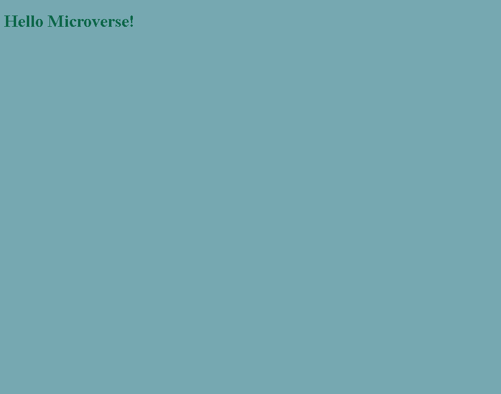

# Hello Microverse Project
This is my first project in Microverse, in this project, I'm applying the new skills learnt.

## Screenshot

## Built With
- Major languages
  - HTML and CSS

- Frameworks
  - Visual Studio Code

## Getting Started
To get a local copy up and running follow these simple example steps.
### Prerequisites
- A Pc with any operative system
- An IDE (preferbly VSCode)
- A Version Control Sistem

### Setup
To start using this project you need:
- Using the console run git clone URL, clone this repository on your computer
- Open the .html file on the browser

### Install
- Install code editor of your choice (used in this project VSCode)
- Install git on your computer

### Usage
You can use this project to learn from it, to propose new changes, to check how the structure of a project looks like and work.

### Deployment
For deployment please rich out to the owner of this project

## Authors
👤 Author1
- GitHub: [Jord4N-AC](https://github.com/Jord4N-AC)
- Twitter: [@jordan12AC](https://twitter.com/jordan12AC)
- LinkedIn: [Camilo Armijos](https://www.linkedin.com/in/camilo-armijos-2b9648197)

## 🤝 Contributing
Contributions, issues, and feature requests are welcome!

## Show your support
Give a ⭐️ if you like this project!

## 📝 License
This project is [MIT](https://github.com/microverseinc/readme-template/blob/master/MIT.md) licensed.
